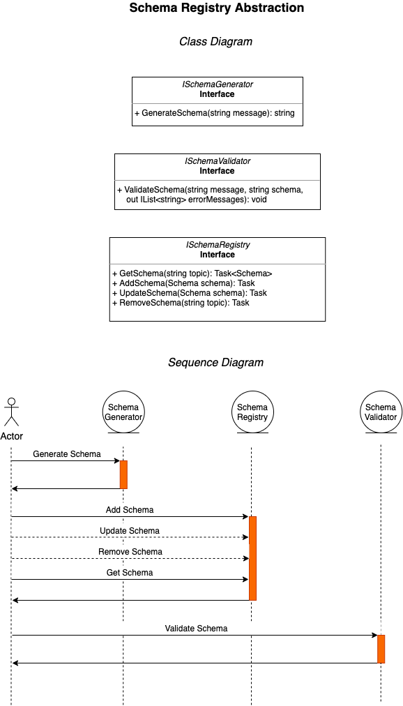

# EventDriven.SchemaRegistry.Mongo

A MongoDB state store for validating messages against schemas that are stored in a registry by topic name.

## Prerequisites
- [.NET Core SDK](https://dotnet.microsoft.com/download) (5.0 or greater)
- [Docker Desktop](https://www.docker.com/products/docker-desktop)
- [MongoDB Docker](https://hub.docker.com/_/mongo): `docker run --name mongo -d -p 27017:27017 -v /tmp/mongo/data:/data/db mongo`
- [MongoDB Client](https://robomongo.org/download):
  - Download Robo 3T only.
  - Add connection to localhost on port 27017.

## Packages
- [EventDriven.SchemaRegistry.Abstractions](https://www.nuget.org/packages/EventDriven.SchemaRegistry.Abstractions)
- [EventDriven.SchemaRegistry.Mongo](https://www.nuget.org/packages/EventDriven.SchemaRegistry.Mongo)

## Introduction

A schema registry helps ensure compatibility between event consumers and producers by correlating topics to registered schemas. When a producer publishes a message with an event bus that is configured with a schema registry, the message will be validated against the schema for the event topic. Consumers can then safely deserialize messages using the schema that is registered for the same topic.

If a producer publishes a message that is not compatible with the schema that has been registered for a specific topic, then the schema registry will raise one or more validation errors which prevent the producer from publishing the message using the topic. For example, if there is a schema registered for the `v1.CustomerAddressChangedEvent` that requires a `City` property, and a producer attempts to publish an event to this topic that is missing `City`, then the schema registry will raise an exception and the event will not be published.

> **Note**: The initial version of the Schema Registry implementation will use [Json Schema](https://www.newtonsoft.com/jsonschema) for JSON message validation. To improve performance a binary format (such as [Protobuf](https://developers.google.com/protocol-buffers)) may be supported in the future.

## Abstractions

The schema registry consists of the following abstractions.
1. **Schema Generator**: `ISchemaGenerator`
   - Generates default schemas based on JSON structure.
   - Hints can be given to control JSON schema generation through the use of Data Annotation attributes. 
   - Generated schemas can be modified according to business rules. For example, certain fields can be designated as required.
   - Default schema evolution rules apply: Fields can be added or removed without breaking compatibility; changing data types will break compatibility.
2. **Schema Validator**: `ISchemaValidator`
   - Validates messages by applying supplied schema.
   - Returns a list of validation error messages, if any.
3. **Schema Registry**: `ISchemaRegistry`
   - Gets, adds, updates and removes schemas from a durable schema key-value store.
   - Event topic name is used as the schema key.
   - Schemas can be versioned by prefixing the topic name, for example, with "v1".
   - Making a breaking schema change requires registration of the schema with a new topic name.

  

## Relationship with Event Bus

   - When configured to use a schema registry, the event bus will validate messages against a registered schema according to event topic name.
   - If `AddSchemaOnPublish` is set to `false`, publishing to an event topic without a registered schema will result in an error.
   - If a message fails schema validation, the event bus will generate an error.

